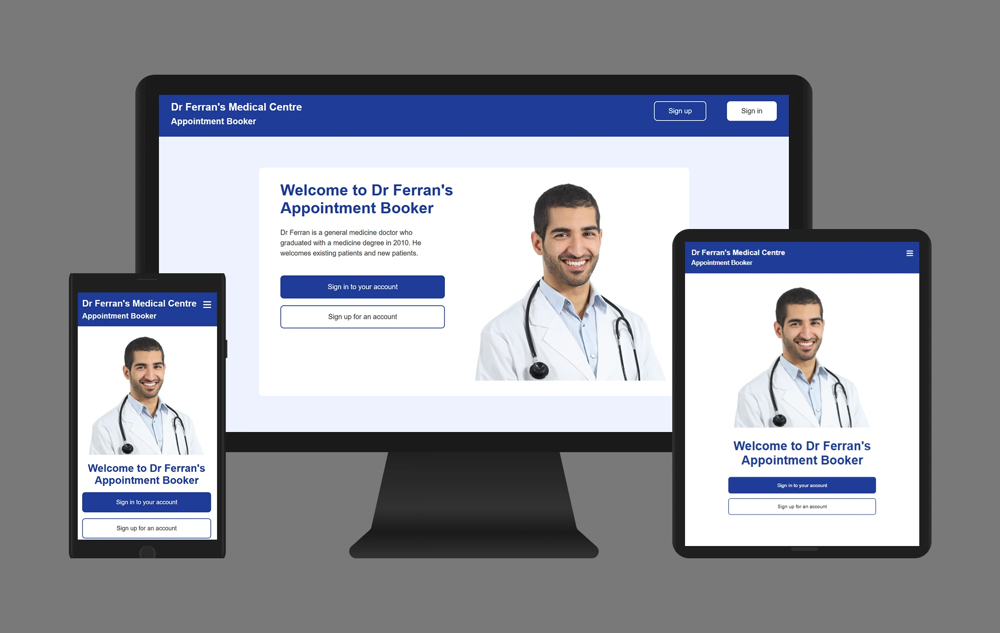
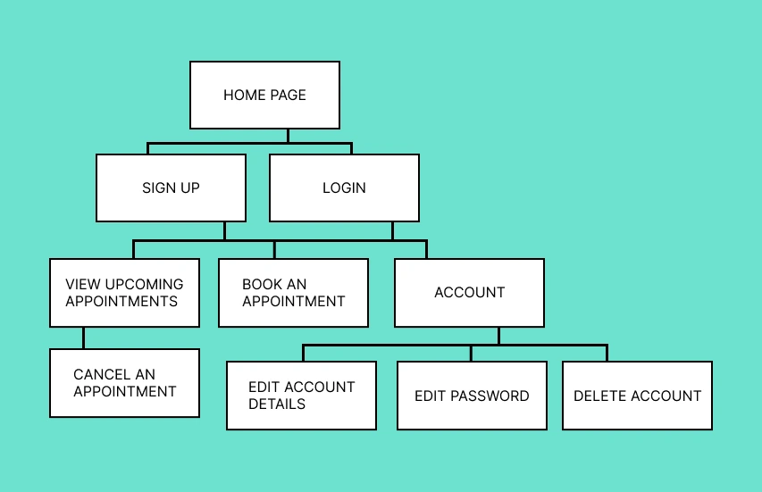
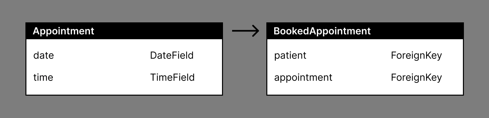
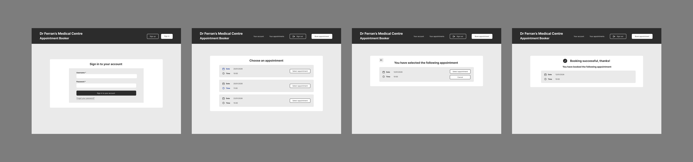

# Appointment-booker
This is a medical appointment booking project built with HTML, CSS, JavaScript, Python and Django.

## Table of contents

- [Introduction](#introduction)
- [Scope](#scope)
- [User research](#user-research)
- [User stories](#user-stories)
- [Sitemap](#sitemap)
- [Database schema](#database-schema)
- [Wireframes](#wireframes)
- [Features](#features)
- [Credits](#credits)

## Introduction

This is a medical appointment booking app that helps to make it easy for patients to book appointments at a medical centre. The website helps to reduce the number of calls coming through to the medical centre. This means that the patients who do call in don't have to wait as long for their call to be answered.
The app provides authentication, accounts and role based permissions. Patients can book appointments, view their upcoming appointments, cancel appointments, edit their account, edit their password and delete their account.

## Film of appointment booker in use

https://github.com/user-attachments/assets/4082142a-70ab-45d2-9fab-bd3026c42ea1

## Scope

### Accounts and authentication

- Ability for patient to sign up for an account
- Ability for patient to sign in to account
- Ability for patient to recover account if they forget their password
- Ability for patient to sign out of account
- Ability for patient to edit account details
- Ability for patient to edit password
- Ability to delete account

### Appointments

- Ability for patient to view available appointments
- Ability for patient to book an appointment
- Ability for patient to cancel an appointment
- Ability for patient to view upcoming appointments that they've booked  

## User research

### Purpose of research

The purpose of the research was to understand why users use medical appointment booking apps and what they want to achieve while using these types of apps. It was also important to understand what kind of tasks patients carry out while using medical appointment booking apps and what their pain points are while using these types of apps.

### Analysing similar apps

Other medical appointment booking apps were examined and analysed. Usability tests were carried out on these apps to get a feel for what could be improved about the apps.

### User research methods

For the qualitative research, I interviewed people who had experience with booking medical appointments online and for the quantitative research, I carried out a survey to find out about what users expect from a medical appointment booking app.

### Key insights from the user research

- Patients want to be able to set up an account
- Patients want to sign in and out of their account easily
- Patients want to be able to book an appointment easily
- Patients want to be able to cancel their booking
- Patients want to avoid double bookings
- Patients want to be able to edit their account
- Patients want to be able to edit their password
- Patients want to be able to delete their account
- Patients want to be able sign in to their account even if they forget their password

## User stories

### Epic - patient account

| USER STORY                                                                                   |RESULT             |
|:---------                                                                                    |:-----------       |           
| As a patient I want to set up an account so that I can easily book appointments online.      |PASS               |
| As a patient I want to able to sign in and out of my account easily.                         |PASS               |
| As a patient I want to able to edit my account details.                                      |PASS               |
| As a patient I want to able to edit my password.                                             |PASS               |
| As a patient I want to able to sign in and out of my account easily.                         |PASS               |
| As a patient I want to able to delete my account.                                            |PASS               |
| As a patient I want to able to sign in even if I forget my password.                         |PASS               |

### Epic - booking an appointment online

| USER STORY                                                                                   |RESULT             |
|:---------                                                                                    |:-----------       |           
| As a patient I want to be able to book an appointment easily online.                         |PASS               |
| As a patient I want to able to see what appointments are available.                          |PASS               |
| As a patient I don't want to book an appointment that someone else has booked.               |PASS               |

### Epic - managing my appointments

| USER STORY                                                                                   |RESULT             |
|:---------                                                                                    |:-----------       |           
| As a patient I want to be able to see what upcoming appointments I've booked.                |PASS               |
| As a patient I want to able to cancel an appointment that I've booked.                       |PASS               |

## Sitemap

## Database schema

## Wireframes

These are some of the wireframes made for the project

## Features

### Authentication and accounts

- Registration form for the patient to set up an account
- Sign in form
- Sign out functionality
- Ability for the patient to view their account details
- Ability for the patient to edit their account details
- Ability for the patient to edit their password while signed in
- Ability for the patient to sign in even if they forget their password
- Ability for the patient to delete their account

### Appointment booking process

- Ability for the patient to view available appointments
- Ability for the patient to choose an available appointment from a list of available appointments
- Ability for the patient to cancel the booking process
- The patient gets a booking confirmation once they have booked an appointment
- Ability for the patient to view their upcoming appointments
- Ability for the patient to cancel an appointment

### Usability testing of features

#### Mobile header

| FEATURE            |TEST PROCEDURE             | EXPECTED OUTCOME                        | ACTUAL OUTCOME                       | RESULT  |
| :--------            | :----------           | :----------                               | :-----------------                |:--------|
 | Logo link              |  The logo link was selected.       | The logo link should take the patient to the home page.  |  The logo link takes the patient to the home page.             | PASS    | 
 | Mobile menu button     | The mobile menu button was pressed | Pressing the mobile menu button should open the mobile menu. Pressing the mobile menu button again should close the menu. |  The mobile menu is opened when the mobile menu button is pressed. If the mobile menu button is pressed while the mobile menu is open the mobile menu closes.           | PASS |
 |"Sign up" link|The "Sign up" link was selected.|The "Sign up" link should lead to the page for registering for an account. |The "Sign up" link leads to the page for registering for an account.|PASS| 
 |"Sign in" link|The “Sign in” link was selected.|The "Sign in" link should lead to the login page.|The “Sign in" link leads to the login page.| PASS |
 |"Your account" link|The "Your account" link was selected.|The "Your account" link should lead to the account page.|The "Your account" link leads to the account page.| PASS |
 |"Your appointments" link|The "Your appointments" link was selected.|The "Your appointments" link should lead to the page with the patient's upcoming appointments.|The "Your appointments" link leads to the page with the patient's upcoming appointments.| PASS |
 |"Sign out" button |The "Sign out" link was button.|The "Sign out" button should sign the patient out of their account.|The "Sign out" button signs the patient out of their account.| PASS |
 |"Book appointment" link |The "Book appointment" link was selected.|The "Book appointment" link should lead to the page with the list of available appointments.|The "Book appointment" link leads to the page with the list of available appointments.| PASS |

#### Desktop header

 | FEATURE                |TEST PROCEDURE                      | EXPECTED OUTCOME      | ACTUAL OUTCOME              | RESULT  |
 |:---------               |:-----------                         |:------------ | :--------------                 |:------- |
 | Logo link              |  The logo link was selected.       | The logo link should take the patient to the home page.  |  The logo link takes the patient to the home page.             | PASS    |
 |"Sign up" link|The "Sign up" link was selected.|The "Sign up" link should lead to the page for registering for an account. |The "Sign up" link leads to the page for registering for an account.|PASS| 
 |"Sign in" link|The “Sign in” link was selected.|The "Sign in" link should lead to the login page.|The “Sign in" link leads to the login page.| PASS |
 |"Your account" link|The "Your account" link was selected.|The "Your account" link should lead to the account page.|The "Your account" link leads to the account page.| PASS |
 |"Your appointments" link|The "Your appointments" link was selected.|The "Your appointments" link should lead to the page with the patient's upcoming appointments.|The "Your appointments" link leads to the page with the patient's upcoming appointments.| PASS |
 |"Sign out" button|The "Sign out" button was pressed.|The "Sign out" button should sign the patient out of their account.|The "Sign out" button signs the patient out of their account.| PASS |
 |"Book appointment" button|The "Book appointment" button was pressed.|The "Book appointment" button should lead to the page with the list of available appointments.|The "Book appointment" button leads to the page with the list of available appointments.| PASS |

#### Message

| FEATURE            |TEST PROCEDURE             | EXPECTED OUTCOME                        | ACTUAL OUTCOME                       | RESULT  |
| :--------            | :----------           | :----------                               | :-----------------                |:--------|
| Close button       | The close button was pressed. |The close button should close the message. |The close button closed the message.| PASS |
 
 #### Introduction

| FEATURE            |TEST PROCEDURE             | EXPECTED OUTCOME                        | ACTUAL OUTCOME                       | RESULT  |
|:--------            |:----------             |:----------                             |:-----------------                    |:--------|
| "Sign in to your account" button       | The "Sign in to your account" button was pressed. |The "Sign in to your account" button should lead to the login page. |The "Sign in to your account" button leads to the login page.| PASS 
| "Sign up for an account" button       | The "Sign up for an account" button was pressed. |The "Sign up for an account" button leads to the page for registering for an account. |The "Sign up for an account" button leads to the page for registering for an account.| PASS |
|"Book an appointment" button|The "Book an appointment" button was pressed.|The "Book an appointment" button should lead to the page with the list of available appointments.|The "Book an appointment" button leads to the page with the list of available appointments.| PASS |
|"Your upcoming appointments" button |The "Your upcoming appointments" button was pressed.|The "Your upcoming appointments" button should lead to the page with the patient's upcoming appointments.|The "Your upcoming appointments" button leads to the page with the patient's upcoming appointments.| PASS |

#### Registration form

| FEATURE            |TEST PROCEDURE             | EXPECTED OUTCOME                        | ACTUAL OUTCOME                       | RESULT  |
|:--------            |:----------             |:----------                             |:-----------------                    |:--------|
| Form input       | Content was typed into the form inputs. | Form inputs should get a dark coloured border when selected. Form inputs should allow content to be typed in them.  | Form inputs get a dark coloured border when selected. Form inputs allow content to be typed in them. | PASS |
|"Sign up for an account" form button| The form button was pressed when the form inputs had valid data in them and when they didn't. | If the form inputs have valid data entered into them then pressing the form button should create an account for the patient and take them to the home page. If the form inputs didn't have valid data entered into them then an error message should appear. |If the form inputs have valid data entered into them then pressing the form button creates an account for the patient and takes them to the home page. If the form inputs didn't have valid data entered into them then an error message appears.| PASS |

#### Sign in form

| FEATURE            |TEST PROCEDURE             | EXPECTED OUTCOME                        | ACTUAL OUTCOME                       | RESULT  |
|:--------            |:----------             |:----------                            |:-----------------                   |:--------|
| Form input       | Content was typed into the form inputs. | Form inputs should get a dark coloured border when selected. Form inputs should allow content to be typed in them  | Form inputs get a dark coloured border when selected. Form inputs allow content to be typed in them. | PASS |
|"Sign in to your account" form button| The form button was pressed when the form inputs had valid data in them and when they didn't. | If the form inputs have valid data entered into them then pressing the form button should sign the patient into their and take them to the home page. If the form inputs didn't have valid data entered into them then an error message should appear. |If the form inputs have valid data entered into them then pressing the form button signs the patient into their account and takes them to the home page. If the form inputs didn't have valid data entered into them then an error message appeared.| PASS |

#### Password reset

| FEATURE            |TEST PROCEDURE             | EXPECTED OUTCOME                        | ACTUAL OUTCOME                       | RESULT  |
|:--------           |:----------                 |:----------                             |:-----------------                    |:--------|
| "Forgot your password?" link       | The link was selected. |The link should lead to the page for entering an email for the password reset. |The link leads to the page for entering an email for the password reset.| PASS |
| Form input for entering an email address for the password reset.| Content was typed into the form input. | The form input should get a dark coloured border when selected. The form input should allow text to be typed in it.  | The form input gets a dark coloured border when selected. The form input allows content to be typed in them. | PASS |
|"Enter your email address" form button| The form button was pressed when the form input had valid data in it and when it didn't. | If the form input has valid data entered into it and the email address is found on the system then pressing the form button should send an email to the patient. If the form input doesn't have valid data entered into it then an error message should appear. |If the form input has valid data entered into it and the email address is found on the system then pressing the form button sends an email to the patient. If the form input doesn't have valid data entered into it then an error message appears.| PASS|
| link in email       | The link was selected. |The link should lead to the page with the form for changing a password. |The link leads to the page with the form for changing a password.| PASS |
| Form input       | Content was typed into the form inputs. | Form inputs should get a dark coloured border when selected. Form inputs should allow content to be typed in them.  | Form inputs get a dark coloured border when selected. Form inputs allow content to be typed in them. | PASS |
|"Update your password" button| The button was pressed when the form inputs had valid data in them and when they didn't. | If the form inputs have valid data entered into them then pressing the form button should update the patient's password and take them to a success page. If the form inputs didn't have valid data entered into them then an error message should appear. |If the form inputs have valid data entered into them then pressing the form button should update the patient's password and take them to a success page. If the form inputs didn't have valid data entered into them then an error message appeared. | PASS |

#### Account details

| FEATURE            |TEST PROCEDURE             | EXPECTED OUTCOME                        | ACTUAL OUTCOME                       | RESULT  |
| :--------            | :----------           | :----------                               | :-----------------                |:--------|
| "Edit your account details" button  | The button was pressed. | The button should lead to the page for editing account details.  |The button leads to the page for editing account details. | PASS |
| "Change your password" button  | The button was pressed. | The button should lead to the page for editing a password.  |The button leads to the page for editing a password. | PASS |
| "Delete your account" button  | The button was pressed. | Pressing the button should lead to the page for the patient to confirm whether or not they want to delete their account.  | Pressing the button leads to the page for the patient to confirm whether or not they want to delete their account.   | PASS |

#### Editing account details

| FEATURE            |TEST PROCEDURE             | EXPECTED OUTCOME                        | ACTUAL OUTCOME                       | RESULT  |
| :--------            | :----------           | :----------                               | :-----------------                |:--------|
| Form input       | Content was typed into the form inputs. | Form inputs should get a dark coloured border when selected. Form inputs should allow content to be typed in them.  | Form inputs get a dark coloured border when selected. Form inputs allow content to be typed in them. | PASS |
|"Edit your account" button| The button was pressed when the form inputs had valid data in them and when they didn't. | If the form inputs have valid data entered into them then pressing the form button should update the patient's account details. If the form inputs didn't have valid data entered into them then an error message should appear. | If the form inputs have valid data entered into them then pressing the form button updated the patient's account details. If the form inputs didn't have valid data entered into them then an error message appeared.  | PASS |

#### Editing a password

| FEATURE            |TEST PROCEDURE             | EXPECTED OUTCOME                        | ACTUAL OUTCOME                       | RESULT  |
| :--------            | :----------           | :----------                               | :-----------------                |:--------|
|  Form input     | Content was typed into the form inputs. | Form inputs should get a dark coloured border when selected. Form inputs should allow content to be typed in them.|Form inputs get a dark coloured border when selected. Form inputs allow content to be typed in them.| PASS |
|"Update your password" button|The button was pressed when the form inputs had valid data in them and when they didn't.|If the form inputs have valid data entered into them then pressing the form button should update the patient's password. If the form inputs didn't have valid data entered into#### Message

#### Deleting an account

| FEATURE            |TEST PROCEDURE             | EXPECTED OUTCOME                        | ACTUAL OUTCOME                       | RESULT  |
| :--------            | :----------           | :----------                               | :-----------------                |:--------|
|"No, don't delete account" button | The button was pressed. |Pressing the button should lead to the account details page. |Pressing the button leads to the account details page.| PASS |
|"Delete account" button|The button was pressed.|Pressing the button should delete the account.|Pressing the button deletes the account.|PASS|

#### Booking an appointment

| FEATURE            |TEST PROCEDURE             | EXPECTED OUTCOME                        | ACTUAL OUTCOME                       | RESULT  |
| :--------            | :----------           | :----------                               | :-----------------                |:--------|
| List of available appointments.| The list of available appointments was checked. |The list should only show appointments that are in the future and not already booked. |The list shows only appointments that are in the future and not already booked.| PASS |
|"Select appointment" button|The button was pressed.|Pressing the button should lead to a page showing the appointment that the patient has selected.|Pressing the button leads to a page showing the appointment that the patient has selected.|PASS|
|"Book appointment" button|The button was pressed.|Pressing the button should book an appointment.|Pressing the button books an appointment.|PASS|
|"Cancel" button|The button was pressed.|Pressing the button should lead to the page with the list of available appointments.|Pressing the button leads to the page with the list of available appointments.|PASS|

#### Viewing upcoming appointments

| FEATURE            |TEST PROCEDURE             | EXPECTED OUTCOME                        | ACTUAL OUTCOME                       | RESULT  |
| :--------            | :----------           | :----------                               | :-----------------                |:--------|
|List of patient's upcoming appointments.|The list was checked.  |The list should only show the patient's upcoming appointments. |The list only shows the patient's upcoming appointments.| PASS |
|"Cancel appointment" button|The button was pressed.|The button should lead to a page that asks if the patient is sure they want to cancel their appointment.|The button leads to a page that asks if the patient is sure they want to cancel their appointment.|PASS|

#### Cancelling an appointment

| FEATURE            |TEST PROCEDURE             | EXPECTED OUTCOME                        | ACTUAL OUTCOME                       | RESULT  |
| :--------            | :----------           | :----------                               | :-----------------                |:--------|
|"Cancel appointment" button|The button was pressed. |Pressing the button should cancel the appointment. |Pressing the button cancels the appointment.| PASS |
|"Don't cancel appointment" button|The button was pressed.|Pressing the button should lead to the page with the patient's upcoming appointments.|Pressing the button leads to the page with the patient's upcoming appointments.|PASS|

## Credits

Font Awesome

Dennis Ivy

Codemy.com

CBI Analytics

Tech With Tim

Pretty Printed

